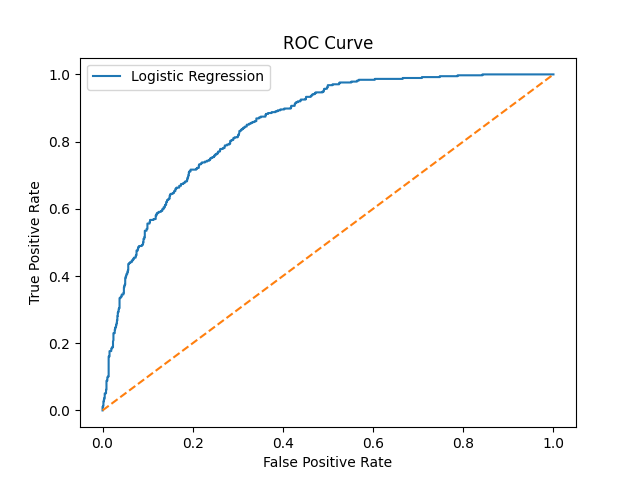
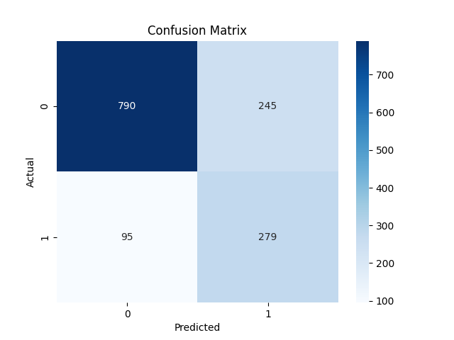
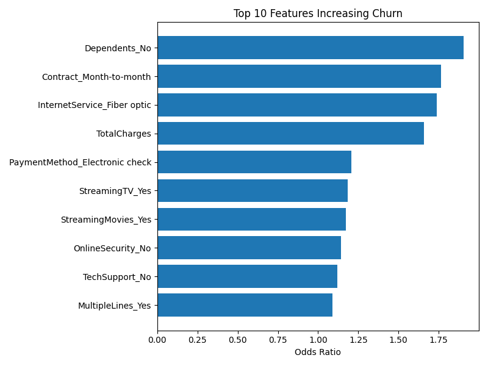
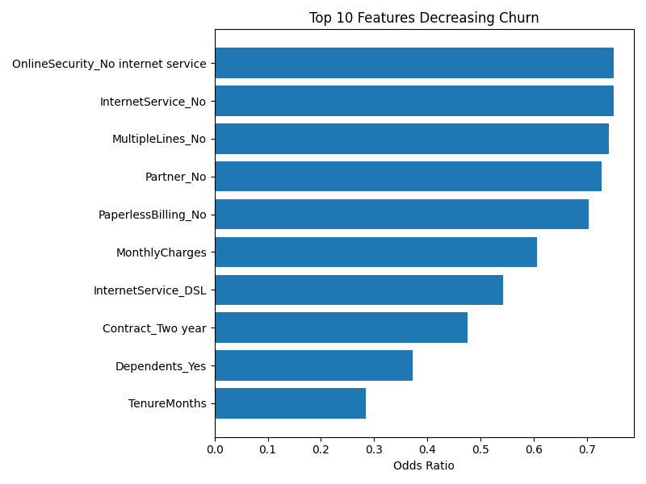

# 📊 Customer Churn Prediction (Telecom)
  An end-to-end production-style machine learning pipeline for telecom churn prediction.


---

---

## Model Performance

### ROC Curve


### Confusion Matrix


---

## Top Churn Drivers

### Increasing Churn


### Decreasing Churn


---
---
##  Project Overview

Customer churn prediction is a critical problem in subscription-based industries.  
This project develops an end-to-end machine learning pipeline to identify customers at risk of leaving a telecom company, enabling proactive retention strategies.

The project focuses not only on predictive performance, but also on business interpretability and decision-making trade-offs.

---

## Problem Definition

Binary Classification Task  

Target Variable: ChurnValue  
- 1 = Customer churned  
- 0 = Customer retained  

The objective is to maximize identification of at-risk customers while balancing the business cost of false positives and false negatives.

---

## Dataset

IBM Telco Customer Churn Dataset  

- 7,043 customers  
- 33 features  
- Includes demographic, contract, billing, and service-related attributes  

---

## Exploratory Data Analysis (EDA)

Key Observations:

- ~27% of customers churned (moderate class imbalance)
- Customers on month-to-month contracts have significantly higher churn rates
- Customers with shorter tenure are more likely to churn
- Contract length strongly correlates with retention

All EDA visualizations are saved in the reports/ directory.

---

## Feature Engineering & Preprocessing

- Cleaned and standardized column names
- Converted TotalCharges to numeric
- Removed data leakage variables (CLTV, ChurnScore, ChurnReason)
- Removed high-cardinality geographic features to prevent overfitting
- Implemented missing value imputation inside the ML pipeline
- One-hot encoded categorical variables
- Standardized numerical features

All preprocessing steps are handled using a ColumnTransformer inside a Scikit-learn Pipeline to prevent data leakage.

---

## Technical Architecture

The project uses a structured ML pipeline:

1. Train/Test split with stratification
2. ColumnTransformer for preprocessing
3. Logistic Regression classifier
4. 5-fold Cross-Validation
5. Threshold tuning for recall optimization
6. Odds Ratio extraction for interpretability
7. Automated saving of feature importance reports

This ensures reproducibility, modularity, and production-style workflow.

---

##  Model Development

Baseline Model: Logistic Regression  

Why Logistic Regression?

- Interpretable coefficients
- Strong baseline for binary classification
- Probability outputs for threshold optimization
- Suitable for business explainability

---

##  Model Evaluation

Metrics Used:

- Accuracy
- Precision
- Recall
- F1-score
- ROC-AUC
- 5-Fold Cross-Validation

### Performance

- ROC-AUC ≈ 0.83
- Recall improved from 53% → 73% after threshold tuning (0.5 → 0.3)

Threshold tuning was applied to prioritize recall, as false negatives (missed churners) are more costly than false positives in churn prediction scenarios.

---

##  Explainability

Model coefficients were transformed into Odds Ratios to identify key churn drivers.

### Strongest Churn Drivers

- Month-to-month contracts  
- No dependents  
- Fiber optic service  

### Strongest Churn Reducers

- Long tenure  
- Two-year contracts  
- Having dependents  

Feature importance reports and visualizations are saved in reports/.

---
### Business Impact

 • Early identification of high-risk customers for proactive intervention
 • Data-driven retention strategy optimization
 • Improved Customer Lifetime Value (CLV) forecasting
 • Marketing budget allocation based on churn probability segmentation
 • Actionable risk scoring framework for decision-makers

⸻
### Model Limitations

 • Dataset reflects U.S. telecom behavior and may not generalize without retraining.
 • Logistic Regression assumes linear log-odds relationships.
 • Class imbalance handled without cost-sensitive weighting.
 • Baseline hyperparameters used without full optimization study.

⸻
### Roadmap & System Extensions

 • Benchmark against tree-based ensemble models (Random Forest, Gradient Boosting, XGBoost)
 • Introduce SHAP-based model interpretability
 • Implement cost-sensitive learning for business-aligned risk modeling
 • Expose model as REST API (FastAPI)
 • Containerize with Docker for production portability
 • Integrate real-world retention budget simulation

---

##  How to Run

```bash
python src/pipeline.py